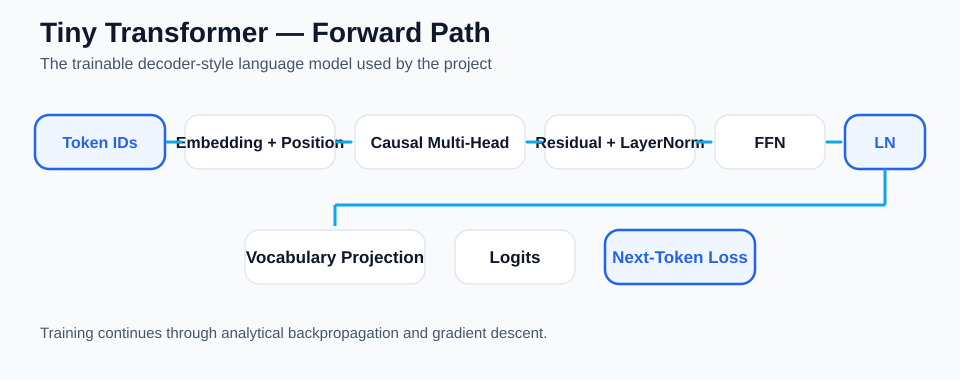
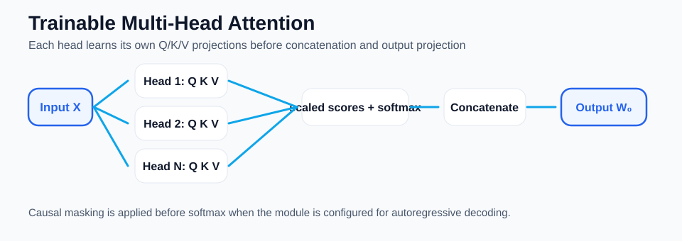
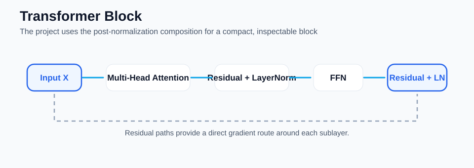
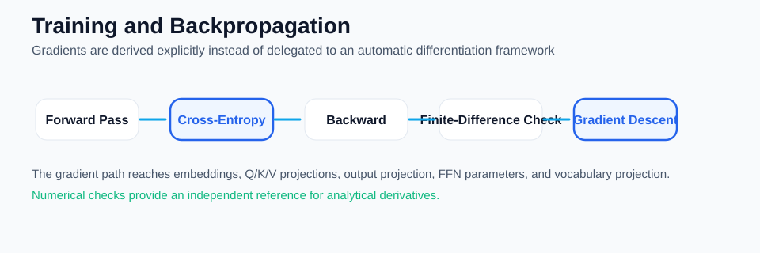

# HowTransformersWork

<p align="center">
  
</p>

<p align="center">
  
  
</p>

<p align="center">
  
  
</p>

> **How does a Transformer turn contextual representations into learned next-token predictions?**

`HowTransformersWork` is a from-scratch **AI / deep-learning project** that assembles and trains a small decoder-style Transformer language model using **Python and NumPy**.

The project starts from the components already understood in [`HowAttentionWorks`](https://github.com/peymanpro/HowAttentionWorks) and moves one architectural level upward:

```text
Attention
    ↓
Multi-Head Attention
    ↓
Residual Connections + LayerNorm
    ↓
Feed-Forward Network
    ↓
Transformer Block
    ↓
Causal Decoder Block
    ↓
Vocabulary Projection
    ↓
Next-Token Prediction
    ↓
Backpropagation
    ↓
Gradient Descent
```

The goal is not to reproduce GPT, PyTorch, or a production Transformer implementation.

The goal is more fundamental:

> **Make the architecture visible enough that we can follow the data, mathematics, gradients, and learning process through a Transformer step by step.**

---

## Why This Project Exists

Transformer implementations are usually encountered through high-level APIs:

```python
model = SomeTransformer(...)
```

That is useful for production, but it hides the architectural chain.

This project exposes the chain:

```text
Token IDs
    │
    ▼
Token Embeddings
    │
    + Positional Information
    │
    ▼
Causal Multi-Head Attention
    │
    ▼
Residual Connection
    │
    ▼
Layer Normalization
    │
    ▼
Position-wise Feed-Forward Network
    │
    ▼
Residual Connection
    │
    ▼
Layer Normalization
    │
    ▼
Vocabulary Projection
    │
    ▼
Logits
    │
    ▼
Cross-Entropy
    │
    ▼
Backpropagation
    │
    ▼
Gradient Descent
```

Every important stage is represented explicitly in the codebase.

---

# What We Actually Built

The project contains the major architectural ideas required to understand a small causal Transformer:

- token embeddings
- sinusoidal positional encoding
- trainable multi-head self-attention
- causal attention masking
- trainable per-head Q/K/V projections
- trainable attention output projection
- residual connections
- layer normalization
- position-wise feed-forward network
- Transformer encoder block
- Transformer decoder-style block
- vocabulary projection
- next-token prediction
- cross-entropy loss from logits
- analytical backpropagation
- numerical gradient verification
- trainable embeddings
- trainable attention output projection
- trainable feed-forward parameters
- trainable vocabulary projection
- a complete training step
- a training loop
- before/after prediction experiments
- automated tests with `pytest`
- static analysis with Ruff
- strict type checking with mypy

The main language-model path uses trainable attention projections. The original synthetic attention implementation remains only as a controlled fixed-routing experiment.

[](https://github.com/peymanpro/HowTransformersWork/actions/workflows/quality.yml)

---

# The Architecture

A simplified view of the model is:

```text
                    Token IDs
                       │
                       ▼
                 Token Embedding
                       │
                       +
                       │
              Positional Encoding
                       │
                       ▼
              Transformer Decoder
                       │
        ┌──────────────┴──────────────┐
        │                             │
        ▼                             │
 Causal Multi-Head Attention          │
        │                             │
        ▼                             │
   Output Projection                 │
        │                             │
        ▼                             │
      Residual ◄──────────────────────┘
        │
        ▼
   Layer Normalization
        │
        ▼
 Feed-Forward Network
        │
        ▼
      Residual
        │
        ▼
   Layer Normalization
        │
        ▼
   Hidden Representation
        │
        ▼
 Vocabulary Projection
        │
        ▼
       Logits
```

This is deliberately smaller than a modern production Transformer, but the architectural relationships are explicit.

---

# 1. Token Embeddings

A token ID is converted into a dense vector:

```text
token_id
   ↓
Embedding Matrix
   ↓
vector ∈ R^d
```

For a sequence:

```text
["the", "cat", "drinks", "milk"]
```

we obtain one representation per token.

The embedding matrix is trainable.

During backpropagation, gradients for repeated tokens are accumulated into the corresponding embedding row.

---

# 2. Positional Information

Self-attention works with token representations, but the architecture also needs a representation of position.

This project uses **sinusoidal positional encoding**.

For position `pos`, dimension `i`, and model dimension `d`:

```math
PE_{pos,2i} = \sin\left(\frac{pos}{10000^{2i/d}}\right)
```

```math
PE_{pos,2i+1} = \cos\left(\frac{pos}{10000^{2i/d}}\right)
```

The Transformer input is:

```math
X = E + PE
```

where:

- `E` is the token embedding matrix
- `PE` is the positional encoding matrix

This makes position part of the representation entering the Transformer block.

---

# 3. Multi-Head Attention

`HowAttentionWorks` already explored scaled dot-product attention in detail.

This project therefore does not repeat that implementation.

Instead, it focuses on the architectural question:

> **What happens when several attention heads are combined?**

Conceptually:

```text
                    Input
                      │
          ┌───────────┼───────────┐
          ▼           ▼           ▼
        Head 1       Head 2      Head N
          │           │           │
          └───────────┼───────────┘
                      ▼
                 Concatenate
                      │
                      ▼
                     W₀
                      │
                      ▼
              Multi-Head Output
```

Each head in the main implementation learns its own query, key, and value projections. The attention weights are computed from those learned projections through scaled dot-product attention.

The repository also keeps `SyntheticMultiHeadAttention` as a separate controlled experiment for isolating fixed-routing behavior.

---

# 4. Causal Attention

For autoregressive next-token prediction, a position must not use future positions.

For:

```text
the cat drinks milk
```

the causal structure is:

```text
          the   cat   drinks   milk

the        ✓     ·       ·       ·
cat        ✓     ✓       ·       ·
drinks     ✓     ✓       ✓       ·
milk       ✓     ✓       ✓       ✓
```

This gives the model the information pattern required for autoregressive prediction:

```text
the
 ↓
cat

the cat
   ↓
drinks

the cat drinks
       ↓
milk
```

The project explicitly tests the causal constraint.

---

# 5. Residual Connections

A Transformer does not simply replace its input with the output of a sublayer.

It preserves a direct path:

```text
             ┌──────────────────────┐
             │                      │
Input ───────┼──────────────┐       │
             │              │       │
             ▼              ▼       │
          Sublayer      Attention   │
             │              │       │
             └─────── + ───┘       │
                     │             │
                     ▼             │
                  Residual ◄────────┘
```

Mathematically:

```math
Y = X + F(X)
```

The backward relationship is especially important:

```math
\frac{\partial L}{\partial X}
=
\frac{\partial L}{\partial Y}
+
\frac{\partial L}{\partial F(X)}
```

The implementation contains explicit residual backward propagation and tests it independently.

---

# 6. Layer Normalization

Each token representation is normalized across its feature dimension.

For a vector `x`:

```math
\mu = \frac{1}{d}\sum_i x_i
```

```math
\sigma^2 = \frac{1}{d}\sum_i (x_i-\mu)^2
```

and:

```math
\hat{x}
=
\frac{x-\mu}
{\sqrt{\sigma^2+\epsilon}}
```

The current educational implementation uses the normalized representation directly:

```text
Residual Output
      ↓
Mean / Variance
      ↓
Normalization
      ↓
Normalized Token Representation
```

The backward implementation is separately verified against finite differences.

---

# 7. Position-Wise Feed-Forward Network

After attention mixes contextual information, each position passes through its own feed-forward transformation.

The project implements:

$$
\mathrm{FFN}(x)
=
\mathrm{ReLU}\left(xW_1+b_1\right)W_2+b_2
$$

The architecture is:

```text
x
│
▼
Linear W₁ + b₁
│
▼
ReLU
│
▼
Linear W₂ + b₂
│
▼
FFN(x)
```

The feed-forward parameters are trainable.

Their backward pass is independently verified numerically.

---

# 8. Transformer Block

The individual pieces now become a single architectural unit.

The current block follows the classic post-normalization pattern used for educational clarity:

```text
                    Input
                      │
                      ▼
              Multi-Head Attention
                      │
                      ▼
                 Residual Add
                      │
                      ▼
                 LayerNorm
                      │
                      ▼
                    FFN
                      │
                      ▼
                 Residual Add
                      │
                      ▼
                 LayerNorm
                      │
                      ▼
                   Output
```

In equations:

```math
H_1 = \mathrm{LayerNorm}\left(X+\mathrm{MHA}(X)\right)
```

```math
H_2 = \mathrm{LayerNorm}\left(H_1+\mathrm{FFN}(H_1)\right)
```

That `H₂` is the block output.

---

# 9. Decoder-Style Block

For language modeling we use the same conceptual block with causal self-attention:

```text
Input
  │
  ▼
Causal Multi-Head Self-Attention
  │
  ▼
Residual + LayerNorm
  │
  ▼
Feed-Forward Network
  │
  ▼
Residual + LayerNorm
  │
  ▼
Hidden State
```

This lets the project move from a Transformer block to a small next-token prediction model.

---

# 10. Vocabulary Projection

The final hidden states are converted into vocabulary logits.

If the hidden states are `H`:

```math
Z = HW_{out} + b
```

where `Z` contains one logit vector per sequence position.

For vocabulary size `V`:

```text
sequence_length × model_dimension
              ↓
       Vocabulary Head
              ↓
sequence_length × V
```

The vocabulary projection is trainable.

---

# 11. Next-Token Prediction

The logits are converted into probabilities:

```math
P_i =
\frac{e^{z_i}}
{\sum_j e^{z_j}}
```

The predicted token is the token with the highest probability.

For the training sequence:

```text
the cat drinks milk
```

the target next tokens are:

```text
cat
drinks
milk
<eos>
```

So the model solves:

```text
the            → cat
the cat        → drinks
the cat drinks → milk
the cat drinks milk → <eos>
```

---

# 12. Cross-Entropy

The training objective is cross-entropy from logits.

For target class `y`:

```math
L = -\log P_y
```

The important gradient identity is:

```math
\frac{\partial L}{\partial z}
=
P-\mathrm{onehot}(y)
```

The implementation uses a numerically stable log-sum-exp formulation rather than constructing unstable exponentials directly.

---

# 13. Backpropagation

The project traces the gradient all the way backward:

```text
Cross-Entropy
      ↓
Vocabulary Projection
      ↓
Decoder Block
      ↓
LayerNorm
      ↓
Residual
      ↓
Feed-Forward
      ↓
Residual
      ↓
LayerNorm
      ↓
Attention Output Projection
      ↓
Embedding
```

The codebase contains separate backward implementations for:

- vocabulary projection
- feed-forward network
- layer normalization
- residual connections
- attention sublayer
- feed-forward sublayer
- encoder block
- decoder block
- complete tiny Transformer

This makes the gradient flow inspectable rather than treating backpropagation as a hidden framework operation.

---

# 14. Numerical Gradient Verification

Analytical gradients are easy to get subtly wrong.

The project therefore uses finite differences as an independent reference:

```math
\frac{\partial L}{\partial x}
\approx
\frac{L(x+\epsilon)-L(x-\epsilon)}
{2\epsilon}
```

Numerical checks are used at multiple levels:

```text
Individual Component
        ↓
Sublayer
        ↓
Transformer Block
        ↓
Model-level gradient path
```

This was particularly useful during development: the full Transformer Block numerical check exposed an incorrect composition of LayerNorm and residual gradients before the implementation was considered complete.

---

# Training

The training pipeline is:

```text
Token IDs
   ↓
Embedding + Position
   ↓
Causal Transformer Block
   ↓
Vocabulary Projection
   ↓
Logits
   ↓
Cross-Entropy
   ↓
Backward
   ↓
Parameter Gradients
   ↓
Gradient Descent
   ↓
Updated Model
```

The trainable parameters include:

```text
Token Embeddings
Per-head Q Projections
Per-head K Projections
Per-head V Projections
Attention Output Projection W₀
Feed-Forward W₁
Feed-Forward b₁
Feed-Forward W₂
Feed-Forward b₂
Vocabulary Projection
Vocabulary Bias
```

The main language-model path therefore learns the attention projections themselves.

---

# Training Result

The repository includes a deterministic next-token experiment on a tiny synthetic sequence.

The useful result is not a single loss value. The experiment demonstrates the complete optimization path:

```text
forward pass
      ↓
cross-entropy loss
      ↓
analytical gradients
      ↓
Q/K/V + W₀ + FFN + embedding + vocabulary updates
      ↓
updated model
      ↓
improved next-token predictions
```

The automated tests verify that training changes the attention projections and improves the controlled training objective.

---

# What This Result Does — and Does Not — Prove

This distinction is important.

The experiment **does demonstrate** that:

```text
The model can execute a Transformer-like forward pass.
                    ↓
A scalar language-modeling loss can be computed.
                    ↓
Gradients can propagate through the assembled model.
                    ↓
Trainable parameters can be updated.
                    ↓
The training objective can decrease dramatically.
                    ↓
Next-token predictions can improve.
```

But it does **not** demonstrate that we have trained a modern GPT-like model.

The implementation intentionally uses:

```text
Small dimensions
Tiny vocabulary
One short training pattern
Single Transformer block
No large-scale corpus
No distributed training
```

The result should therefore be interpreted as:

> **A controlled demonstration that a small Transformer-style language model can be assembled from explicit components and trained end-to-end with verified attention gradients.**

That is the purpose of the repository.

---

# A Full Forward Pass at a Glance

For one sequence:

```text
"the cat drinks milk"
          │
          ▼
     Token IDs
          │
          ▼
   Token Embeddings
          │
          +
          │
          ▼
 Positional Information
          │
          ▼
 Causal Multi-Head Attention
          │
          ▼
      Residual
          │
          ▼
     LayerNorm
          │
          ▼
        FFN
          │
          ▼
      Residual
          │
          ▼
     LayerNorm
          │
          ▼
   Hidden Representations
          │
          ▼
 Vocabulary Projection
          │
          ▼
        Logits
          │
          ▼
     Next Token
```

And backward:

```text
Loss
 │
 ▼
dLogits
 │
 ▼
Vocabulary Projection
 │
 ▼
Decoder Block
 │
 ├── LayerNorm
 ├── Residual
 ├── FFN
 ├── Residual
 ├── LayerNorm
 ├── Attention Q/K/V Projections
 ├── Attention Output Projection
 │
 ▼
Embedding Gradients
 │
 ▼
Gradient Descent
```

---

# Project Structure

```text
HowTransformersWork/
│
├── src/
│   ├── attention/
│   │   └── synthetic_head.py
│   │
│   ├── math/
│   │   └── matrix.py
│   │
│   ├── transformer/
│   │   ├── attention_sublayer.py
│   │   ├── attention_sublayer_backward.py
│   │   ├── cross_entropy.py
│   │   ├── decoder_block.py
│   │   ├── decoder_block_backward.py
│   │   ├── embedding.py
│   │   ├── embedding_backward.py
│   │   ├── encoder_block.py
│   │   ├── encoder_block_backward.py
│   │   ├── feed_forward.py
│   │   ├── feed_forward_backward.py
│   │   ├── feed_forward_sublayer_backward.py
│   │   ├── language_model.py
│   │   ├── language_model_backward.py
│   │   ├── layer_norm.py
│   │   ├── layer_norm_backward.py
│   │   ├── multi_head.py
│   │   ├── trainable_multi_head.py
│   │   ├── multi_head_backward.py
│   │   ├── output_head.py
│   │   ├── output_head_backward.py
│   │   ├── positional_encoding.py
│   │   ├── prediction.py
│   │   ├── residual.py
│   │   ├── residual_backward.py
│   │   ├── training.py
│   │   └── training_step.py
│   │
│   └── experiments/
│       ├── attention_sublayer_demo.py
│       ├── before_after_prediction.py
│       ├── decoder_block_demo.py
│       ├── encoder_block_demo.py
│       ├── feed_forward_demo.py
│       ├── language_model_demo.py
│       ├── multi_head_demo.py
│       ├── residual_demo.py
│       ├── training_demo.py
│       ├── trainable_multi_head_demo.py
│       └── transformer_input_demo.py
│
├── docs/
│   └── assets/
│       ├── transformer-flow.gif
│       ├── transformer-architecture.svg
│       ├── multi-head-detail.svg
│       ├── block-detail.svg
│       └── training-backward.svg
├── tests/
├── pyproject.toml
└── README.md
```

The names intentionally mirror the conceptual architecture so that the code can be read alongside the mathematics.

---

# Testing

The current CI suite verifies the repository with:

```text
127 passed
```

Run:

```bash
python -m pytest
```

Static quality:

```bash
python -m ruff check .
```

Type checking:

```bash
python -m mypy src
```

All three checks are part of the project's development workflow.

---

# Running the Main Experiments

### Transformer Input

```bash
python -m src.experiments.transformer_input_demo
```

Shows:

```text
Token Embeddings
+
Positional Encoding
=
Transformer Input
```

### Trainable Multi-Head Attention

```bash
python -m src.experiments.trainable_multi_head_demo
```

Shows the trainable attention module, per-head attention weights, concatenated head outputs, and the final output projection.

### Synthetic Multi-Head Attention

```bash
python -m src.experiments.multi_head_demo
```

Shows the controlled fixed-routing experiment and keeps it separate from the trainable model.

### Encoder Block

```bash
python -m src.experiments.encoder_block_demo
```

Shows:

```text
Multi-Head Attention
        ↓
Residual + LayerNorm
        ↓
Feed-Forward
        ↓
Residual + LayerNorm
```

### Decoder Block

```bash
python -m src.experiments.decoder_block_demo
```

Shows the causal Transformer-style block.

### Training

```bash
python -m src.experiments.training_demo
```

Shows the training-loss trajectory.

### Before / After Prediction

```bash
python -m src.experiments.before_after_prediction
```

Shows how token predictions and target probabilities change after training.

---

# Engineering Principles

## 1. Keep the architecture visible

The implementation prefers explicit components over a single opaque model class.

## 2. Separate forward and backward logic

Every major mathematical component has an explicit backward implementation where appropriate.

## 3. Verify gradients numerically

Gradient checks are treated as correctness infrastructure.

## 4. Test behavior, not just shapes

The tests check numerical behavior, constraints, training effects, and gradient consistency.

## 5. Make experimental limitations explicit

A controlled experiment is only useful when we understand what it actually proves.

## 6. Use the smallest model that can demonstrate the idea

The project deliberately favors a tiny, inspectable model over an artificially complex implementation.

---

# What This Project Is Not

This repository is **not**:

- GPT
- a production Transformer library
- a replacement for PyTorch
- a large language model
- a large-scale training system
- a benchmark implementation
- a faithful reproduction of a modern production decoder

It intentionally does not implement the complete stack found in modern large language models, such as:

```text
Large-scale corpora
Distributed training
Mixed precision
GPU kernels
KV caching
Flash Attention
Large model parallelism
Millions / billions of parameters
```

The project stops at the point where the Transformer architecture and its learning path become understandable and experimentally inspectable.

---

# Why Keep a Synthetic Attention Experiment?

`SyntheticMultiHeadAttention` remains as a controlled fixed-routing baseline for architectural experiments.

`HowAttentionWorks` studies attention mechanisms and their gradient mechanics directly. `HowTransformersWork` studies how attention behaves when assembled into a larger Transformer-style learning system.

Keeping the synthetic implementation available makes it possible to compare:

```text
controlled fixed routing
        vs
learned attention projections
```

The important boundary is that the **main language-model training path uses `TrainableMultiHeadAttention`**. Synthetic routing is not used as the learned attention mechanism of the language model.

---

# From Attention to Transformer

The conceptual progression across the two projects is:

```text
                    HowAttentionWorks
                           │
                           ▼
                Scaled Dot-Product Attention
                           │
                           ▼
                 Q / K / V + Gradients
                           │
                           ▼
                 Multi-Head Architecture
                           │
                           ▼
               HowTransformersWork
                           │
             ┌─────────────┼─────────────┐
             ▼             ▼             ▼
          Residual      LayerNorm       FFN
             │             │             │
             └─────────────┼─────────────┘
                           ▼
                    Transformer Block
                           │
                           ▼
                  Causal Decoder Block
                           │
                           ▼
                  Next-Token Prediction
                           │
                           ▼
                      LLM Concepts
```

This is intentional.

The repositories form a learning path rather than a collection of unrelated demos.

---

# Learning Path

`HowTransformersWork` is one step in a broader progression:

```text
HowDeepLearningWorks
        ↓
Neural-network fundamentals
        ↓
HowAILearnsLanguage
        ↓
Language learning concepts
        ↓
HowAttentionWorks
        ↓
Attention mechanism
        ↓
HowTransformersWork
        ↓
Transformer architecture
        ↓
HowLLMsWork
        ↓
Large-language-model concepts
        ↓
AI System Architecture
        ↓
Production AI systems
```

The point is to understand each abstraction before moving to the next one.

---

# Key Takeaway

A Transformer is not one mysterious operation.

It is a composition of understandable mechanisms:

```text
Representation
      +
Position
      +
Attention
      +
Residual Learning
      +
Normalization
      +
Feed-Forward Transformation
      +
Prediction
      +
Backpropagation
      +
Optimization
```

The most important lesson from this repository is therefore not:

> "I implemented a Transformer."

It is:

> **I can trace what happens to a token representation as it passes through a Transformer, trace the loss backward through the same architecture, and verify that parameter updates improve next-token prediction.**

That is the conceptual bridge from understanding Attention to understanding Transformers and, eventually, modern language models.

---

# Technology

```text
Python 3.12
NumPy
pytest
Ruff
mypy
```

No deep-learning framework is required for the core implementation.

---

# License

MIT. See [LICENSE](LICENSE).
